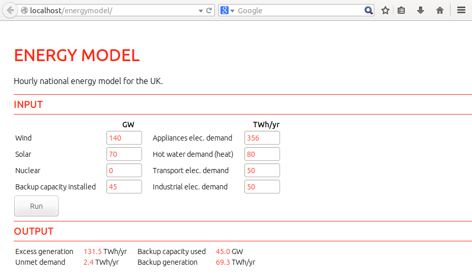

energymodel
===========

Hourly UK energy system model

### JAVA Version

### Web based javascript version

The web based javascript version is a port of the java version so that it can be ran as a webpage. The port is not yet complete, it does not yet contain the supply and demand graph thats in the java version.

To run the web version, install an apache server on your computer or web server and copy to energymodel_webjs folder into the /var/www/ or public html directory.

