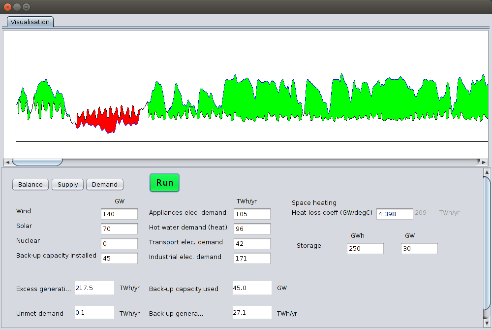

energymodel
===========

Hourly UK energy system model

### JAVA Version

To run navigate to the dist folder and run with:

    java -jar "EnergyModel.jar"

### Web based javascript version

The web based javascript version is a port of the java version so that it can be ran as a webpage. 

To run the web version, install an apache server on your computer or web server and copy the energymodel_webjs folder into the /var/www/ or public html directory.

