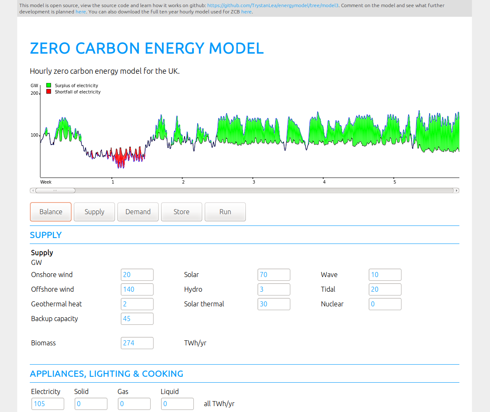

# Open source hourly zero carbon energy system model - variant 3

Model 3 evolved from the 'complex' branch variant of Philip James's Zero Carbon Energy system model here https://github.com/philJam/energymodel/tree/complex. The current implementation in the complex branch model's storage slightly differently to this implementation.

